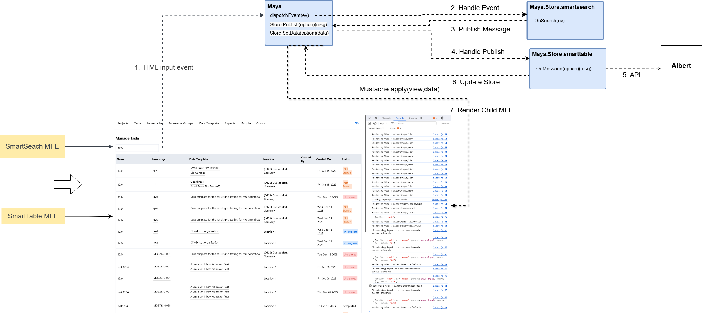

**White Paper: Event Handling in Maya – Self Syncing & One-Way Data Binding**

## **Introduction**
Maya is a **Micro Front-End (MFE) framework** that provides a structured approach to handling **user interactions and events**. One of its most powerful features is its **automatic syncing of input data to `self`**, which ensures **one-way data binding** between UI components and the store. This eliminates the need for manually fetching input values using `document.getElementById()` and simplifies the interaction between the user interface and business logic.



This white paper explores:
1. **How Maya handles default events (`click` & `input`)**
2. **How `self` is used for automatic data syncing**
3. **One-way data binding and how it improves state management**
4. **How event handlers extract `self` data, transform it, and call APIs**
5. **Advantages of self-syncing and eliminating manual DOM queries**

---
## **1. Default Event Handling in Maya**
By default, Maya listens for **click and input events** on **Maya components**. These events trigger **operations** defined within the corresponding MFE’s store, rather than calling an MFE’s `onclick` or `oninput` method directly.

### **Supported Default Events:**
| **Event Type** | **Behavior** |
|--------------|-------------|
| `click` | Calls the `operationId` specified in the component declaration |
| `input` | Automatically syncs data to `Maya.Store.<mfe>.self<key>` |

### **Example: Default Click Handling with `operationId`**
If a button inside an MFE has a `store` and `operationId` defined, clicking it will trigger the corresponding **operation** (not an MFE `onclick` function).
```html
<maya-button store="userProfile" operationId="saveUser"></maya-button>
```
This automatically calls:
```javascript
Maya.Store.userProfile.events.saveUser({ type: 'click' });
```

---
## **2. Self Syncing – How Maya Automatically Syncs Input Data**
Unlike traditional frameworks where input fields require explicit event handlers to update the store, Maya **automatically syncs input values to `Maya.Store.<mfe>.self<key>`**.

### **Example: Auto-Syncing User Input**
```html
<maya-input store="userProfile" name="email">
    <input type="email" placeholder="Enter email">
</maya-input>
```
#### **What Happens?**
1. When the user types into the input field, Maya **automatically updates**:
   ```javascript
   Maya.Store.userProfile.self[<key>].email = 'test@example.com';
   ```
2. This ensures **real-time state management** without requiring a separate event listener.

✅ **Why This Matters:**
- **No need for manual event listeners for input fields.**
- **Automatically keeps the UI and store in sync.**
- **Ensures data is always available to event handlers.**

---
## **3. One-Way Data Binding – How It Works**
Maya follows a **one-way data binding model**, where:
- User input **modifies the store** (`self`), but components don’t fetch data back from the store unless explicitly told to.
- This prevents unnecessary re-renders and **improves performance**.

### **Example: How Self Data is Used in an Event Handler**
```html
<maya-input store="userProfile" name="email">
    <input type="email" placeholder="Enter email">
</maya-input>
<maya-button store="userProfile" operationId="saveUser"></maya-button>
```
#### **Event Handler in `Maya.Store`**
```javascript
Maya.Store.userProfile.events.saveUser = async (event) => {
    // Extract data from `self`
    let email = Maya.Store.userProfile.self[event.key].email;
    
    // Apply transformation (e.g., trim input)
    email = email.trim();
    
    // Call API
    let response = await fetch('/api/saveUser', {
        method: 'POST',
        body: JSON.stringify({ email })
    });
    console.log('User saved:', response);
};
```
### **How This Works:**
1. The user **types an email** → Maya automatically stores it in `self`.
2. The user **clicks the button** → Maya calls `saveUser`.
3. The function **retrieves the email from `self`**, **transforms the data**, and **calls an API**.

✅ **No need for `document.getElementById()` or manual data fetching!**

---
## **4. Eliminating `getElementById` and Manual Input Handling**
Traditional approaches require developers to manually fetch user input using DOM queries:
```javascript
let email = document.getElementById('emailField').value;
```
This approach has several downsides:
❌ **Extra boilerplate code** → More lines of code to maintain.
❌ **Manual state syncing** → Data isn’t automatically stored.
❌ **Potential DOM inconsistencies** → If elements are dynamically updated, references may break.

### **How Maya Eliminates This:**
✅ **All inputs automatically sync to `self`**.
✅ **No need to manually extract data from input fields**.
✅ **Ensures data is always accessible and consistent.**

---
## **5. Advantages of Self-Syncing & One-Way Data Binding**
### **✅ Simplifies Event Handling**
- Event handlers can **directly extract user input from `self`** without querying the DOM.

### **✅ Reduces Boilerplate Code**
- No need for extra code to store and retrieve user input manually.

### **✅ Improves Performance**
- **No unnecessary event listeners** or state updates.
- **Only the relevant data is stored**, avoiding UI flickering.

### **✅ Enhances Code Maintainability**
- Developers can **focus on logic** rather than handling UI state manually.

---
## **6. Real-World Example: A Login Form in Maya**
### **Scenario:**
- A user enters their **email and password**.
- The login button **triggers an API request**.
- The input values **are retrieved from `self` without querying the DOM**.

### **Implementation:**
#### **HTML**
```html
<maya-input store="auth" name="email">
    <input type="email" placeholder="Email">
</maya-input>
<maya-input store="auth" name="password">
    <input type="password" placeholder="Password">
</maya-input>
<maya-button store="auth" operationId="login"></maya-button>
```

#### **Event Handler in `Maya.Store`**
```javascript
Maya.Store.auth.events.login = async (event) => {
    let email = Maya.Store.auth.self[event.key].email.trim();
    let password = Maya.Store.auth.self[event.key].password;
    
    let response = await fetch('/api/login', {
        method: 'POST',
        body: JSON.stringify({ email, password })
    });
    console.log('Login response:', response);
};
```
### **How This Works:**
✅ **No need for `document.getElementById()`**.
✅ **Data is automatically stored and retrieved from `self`**.
✅ **Reduces complexity and improves efficiency.**

---
## **Conclusion**
Maya’s **self-syncing and one-way data binding** ensure that user input is seamlessly stored and accessible within event handlers.

### **Key Takeaways:**
✅ **Inputs automatically sync to `Maya.Store.<mfe>.self<key>`.**
✅ **No need for `getElementById()` or manual data fetching.**
✅ **One-way data binding improves performance and simplifies code.**
✅ **Event handlers directly extract input values, apply transformations, and call APIs.**

By following this approach, developers can build **efficient, scalable, and maintainable Maya applications**. 🚀

