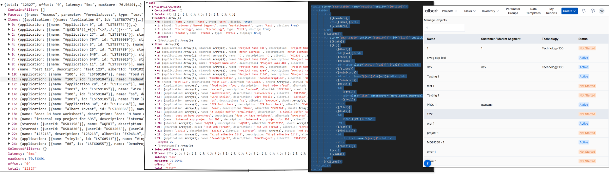

# Maya - A Micro Front-End Framework

## Overview


Maya is a **Micro Front-End (MFE) framework** designed to build modular, scalable, and dynamic web applications. It breaks down large applications into smaller, independent pieces called MFEs, each responsible for a specific functionality.

## Why Use Maya?
### Key Features:
- **⚛️ Native Micro Front-End Framework:** Each MFE is an encapsulated web component with its own **Shadow DOM**, ensuring isolation and preventing style conflicts.
- **🏄 Dynamic Loading Using Slots:** Uses the `<slot>` tag to load MFEs dynamically, ensuring efficient resource usage and faster load times.
- **🎡 Decentralized State Management:** Each MFE maintains its own store and event handlers.
- **☀️ Separation of Concerns:** Utilizes **Mustache templates** for rendering views and a centralized store to manage state.
- **🚀 Lightweight and Fast:** Uses pure **HTML (Mustache template), CSS, and JavaScript**, reducing dependency overhead.
- **✉️ Pubsub for MFE 2 MFE communication:** Asynchronous message based communcation between MFEs.
- **☁️ CDN Deployment:** MFEs and components can be easily deployed via a **CDN** for faster global distribution.

> [✅ **What is Maya - deep dive**](readme/maya.md) 


---

## MFEs: The Building Blocks of Maya Applications
MFEs are self-contained, independently developed, and deployable web components that form the foundation of a Maya application.

### Characteristics of an MFE:
- **Self-contained:** Each MFE has its own **JavaScript** (`index.js`) and **HTML views** (`Mustache templates`). You can decalre and / or import as many inner MFEs inside the primary MFE index.js. Inner MFE's cannot be Routed (URL loaded) but can be dynamocally Loaded (javascript) at any Slots.
- **Independent:** MFEs are independently developed, tested, and deployed, allowing for true modularity. Maya enforces a straightforward directory structure for each MFE, keeping organization simple and consistent. 
- **Loose Coupling via Slots:** MFEs anchor themselves to predefined slots (main, center, overl, left, right, menu, submenu etc...), making dynamic rendering seamless. Beyond just fitting into existing slots, MFEs can declare their own slots, effectively creating new anchor points for other MFEs. This recursive capability forms a fractal architecture, where MFEs can continuously nest and grow the application modularly. Each layer expands the surface for new MFEs, enabling infinite composability within a self-contained structure.
- **Separation of Logic and View:** Business logic is managed via **Maya Store**, while the UI is defined in Mustache templates. MFEs are self-contained web components responsible for hosting their views. While the UI is defined using Mustache templates, the business logic and state management are handled through the Maya Store. 

#### Data  Flow : API -> Transformation -> Store Update -> Apply View -> HTML


> [✅ **MFEs are launched inside Maya app - learn more**](readme/maya-app.md)

---

## Anatomy of an MFE
An MFE typically includes:
```
/mfe/<mfe-name>/
  /js/
    index.js       # Main logic, store, events, MFE declaration
  /view/
    main.html      # Main view
    detail.html    # Optional detail view
```

### Naming Conventions:
- **✅ MFE Name:** Lowercase, no spaces or special characters. e.g : inventory
- **✅ Store Name:** Same as the MFE name. e.g : inventory
- **✅ Child MFE Naming:** Prefix with parent MFE name. Declare in the parent js file. Has it's own store. e.g : inventory-lots
- **✅ Registration:** MFE name. e.g : inventory

---

## MFE & Store Declaration
Each MFE has an associated **store** that manages its state and events.

#### Example: Declaring an MFE and Store
```javascript
Maya.Store.inventory = {
    events: {
        onLoad: async (options) => {
            if (options.view === 'detail') {
                const data = await Maya.API.getInventoryById({ id: options.query });
                Maya.Store.SetData({ store: 'inventory', key: options.key })(data);
            } else {
                const data = await Maya.API.searchInventories({ limit: 50 });
                Maya.Store.SetData({ store: 'inventory', key: options.key })(data);
            }
        }
    }
};

class InventoryMFE extends MayaMFE {
    constructor() {
        super();
        this.setStore(Maya.Store.inventory);
    }
    onLoad = async (options) => {
        this.setView(options.view || 'main');
        return Maya.Store.inventory.events.onLoad(options);
    };
}

Maya.Register({ name : 'inventory'})(InventoryMFE);
```

---

## Views
Maya uses **Mustache-based HTML templates** stored in the `/view/` folder.

#### Example: `main.html` - Inventory List View
```html
<h1>{{maya.title}}</h1>
<table class="inventory-table">
  <thead>
    <tr>
      <th>Name</th>
      <th>Quantity</th>
    </tr>
  </thead>
  <tbody>
    {{#Items}}
    <tr>
      <td>{{name}}</td>
      <td>{{quantity}}</td>
      <td><a href="#/inventory/detail?id={{id}}">View Details</a></td>
    </tr>
    {{/Items}}
  </tbody>
</table>
```

---

## Deployment and Loading
Maya allows independent deployment of MFEs. MFEs are dynamically loaded into **slots**.

#### Browser Loading: 
MFE can be launched using #mfe anytime, in the browser.
```html
https://app.albertinvent.com#inventory[/view][?target='main']
```

#### Static Slot Declaration: 
```html
<albert-inventory slot="main"></albert-inventory>
```

#### Dynamic Loading:
```javascript
Maya.Route('inventory[/main | detail][?target=main]');  // Location Change
Maya.Load('inventory[/main | detail][?target=main]');  // No Location Change
```

---

## State Management
Maya MFEs store data using `Maya.Store.SetData`. Each MFE instance gets a **unique key**, ensuring data integrity across multiple instances. Setting the Store re-renders the MFE with existing / specified view.

#### Example: Setting Data in Store
```javascript
const data = await Maya.API.searchInventories({ limit: 50 });
Maya.Store.SetData({ store: 'inventory', key: options.key })(data);
```

#### Example: Setting a named property inside the Data in Store
This will re-render the inner MFE attached to 'email' change...
```javascript
const data = await Maya.API.searchInventories({ limit: 50 });
Maya.Store.SetData({ store: 'inventory', key: options.key, name : 'email' })('neelesh@albertinvent.com');
```

---

## Event Handling
Maya components trigger event handlers defined in the **store**.

Maya uses attribute : **operationId** to trigger the handler, defined under the events
```
<albert-inventory-item store="inventory-item" operationId="OnDelete"></albert-inventory-item>
```

#### Example: Handling Events
```javascript
Maya.Store.['inventory-item'] = {
    events: {
        OnDelete: async ev => { Maya.Close({target: 'mfe', key: ev.key })}
    }
};
```

---

## MFE to MFE Communication
Maya enables inter-MFE communication using **Publish/Subscribe** and **Shared Data**.

### Publish/Subscribe Mechanism
```javascript
// Publisher
Maya.Store.Publish({ topic: 'helloworld' })({ msg: "Hello Neelesh!" });

// Subscriber
Maya.Store.Subscribe({ topic: 'helloworld' })(this);

// Delivery - MFE : onMessage
onMessage = (option) => async (msg) => {
  console.log("Message received:", msg);
  // Add custom logic here
};

```

### Shared Data (Global State)
```javascript
// Set Shared Data
Maya.Store.SetSharedData({ key: 'globalData' })(data);

// Get Shared Data
const data = Maya.Store.GetSharedData({ key: 'globalData' });
```
---

## Lifecycle Management
Maya MFEs have lifecycle hooks:
- **onLoad:** Called when an MFE is loaded.
- **onRender:** Called after rendering.
- **onMessage:** Handles inter-MFE messages.
- **onQuery:** Handles URL query changes.
- **onUnload:** Cleanup logic when an MFE is removed.

---

## Dependencies
Maya supports internal and external dependencies.

### MFE Dependencies:
```javascript
this.setDependency(['dependent-mfe']);
```

### External Dependencies:
```javascript
Maya.SetExternalDependency([{ name: 'lib', path: '<url>' }]);
```

---

## Application Initialization and Navigation
Maya initializes the application using the `maya-maya` component.

### Routing and Navigation:
```javascript
Maya.Route('inventory/main');  // Updates URL
Maya.Load('inventory/main');  // Loads without changing URL
```

---

## Versioning
Maya tracks MFE versions via `version.json`. On deployment, **CloudFront cache is invalidated**, ensuring users fetch the latest assets.

```json
{
    "mfe-name": "commit-id"
}
```

---

## Deep Dive

[Maya Developer Guide](readme/maya-developer.md)

[Maya Cheatsheet](readme/maya-cheatsheet.md)

[Understanding Maya](readme/maya.md)

[Maya App and How Maya launches MFEs](readme/maya-app.md)

[Understanding Maya MFE](readme/maya-mfe.md)

[MFE Anchoring](readme/maya-slot.md)

[Loading / Routing MFEs](readme/maya-mfe-loading.md)

[Maya naming conventions](readme/maya-naming-conventions.md)

[Maya & state management](readme/maya-state.md)

[Maya event handling & data binding](readme/maya-event-handling.md)

[Child MFE (Fractal Architecture)](readme/maya-child-mfe.md)

[Multiple instances of same MFE](readme/maya-key.md)

[Maya vs Others - React, Amngular, Vue](readme/maya-vs-others.md)


## Podcast
[Maya](assets/podcast-maya.wav)


