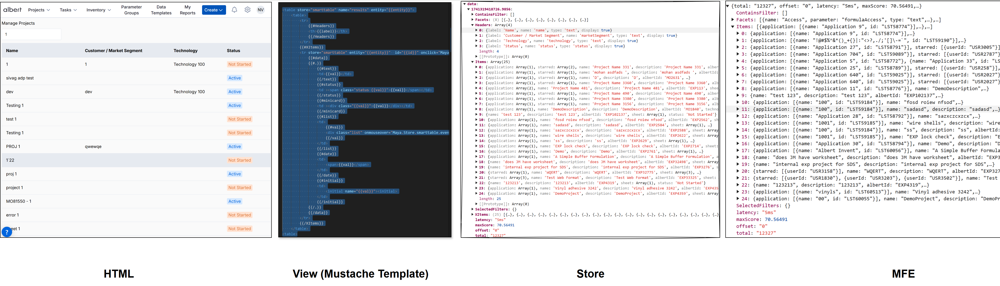

# Maya - A Micro Front-End Framework

## Overview

Maya is a **Micro Front-End (MFE) framework** designed to build modular, scalable, and dynamic web applications. It breaks down large applications into smaller, independent pieces called MFEs, each responsible for a specific functionality.

## Why Use Maya?
### Key Features:
- **Native Micro Front-End Framework:** Each MFE is an encapsulated web component with its own **Shadow DOM**, ensuring isolation and preventing style conflicts.
- **Dynamic Loading Using Slots:** Uses the `<slot>` tag to load MFEs dynamically, ensuring efficient resource usage and faster load times.
- **Decentralized State Management:** Each MFE maintains its own store and event handlers.
- **Separation of Concerns:** Utilizes **Mustache templates** for rendering views and a centralized store to manage state.
- **Lightweight and Fast:** Uses pure **HTML, CSS, and JavaScript**, reducing dependency overhead.
- **CDN Deployment:** MFEs and components can be easily deployed via a **CDN** for faster global distribution.

---

## MFEs: The Building Blocks of Maya Applications
MFEs are self-contained, independently developed, and deployable web components that form the foundation of a Maya application.

### Characteristics of an MFE:
- **Self-contained:** Each MFE has its own **JavaScript** (`index.js`) and **HTML views** (`Mustache templates`).
- **Independent:** MFEs can be developed, tested, and deployed separately.
- **Loose Coupling via Slots:** MFEs anchor themselves to predefined slots, making dynamic rendering seamless.
- **Separation of Logic and View:** Business logic is managed via **Maya Store**, while the UI is defined in Mustache templates.

Data Flow - Call API -> Transform data -> Apply View -> Render HTML 


---

## Anatomy of an MFE
An MFE typically includes:
```
/mfe/<mfe-name>/
  /js/
    index.js       # Main logic, store, events, MFE declaration
  /view/
    main.html      # Main view
    detail.html    # Optional detail view
```

### Naming Conventions:
- **MFE Name:** Lowercase, no spaces or special characters.
- **Store Name:** Same as the MFE name.
- **Child MFE Naming:** Prefix with parent MFE name.

---

## MFE & Store Declaration
Each MFE has an associated **store** that manages its state and events.

#### Example: Declaring an MFE and Store
```javascript
Maya.Store.inventory = {
    name: 'inventory',
    data: {},
    events: {
        onLoad: async (options) => {
            if (options.view === 'detail') {
                const data = await Maya.API.getInventoryById({ id: options.query });
                Maya.Store.SetData({ store: 'inventory', key: options.key })(data);
            } else {
                const data = await Maya.API.searchInventories({ limit: 50 });
                Maya.Store.SetData({ store: 'inventory', key: options.key })(data);
            }
        }
    }
};

class InventoryMFE extends MayaMFE {
    constructor() {
        super();
        this.setStore(Maya.Store.inventory);
    }
    onLoad = async (options) => {
        this.setView(options.view || 'main');
        return Maya.Store.inventory.events.onLoad(options);
    };
}

window.customElements.define('albert-inventory', InventoryMFE);
```

---

## Views
Maya uses **Mustache-based HTML templates** stored in the `/view/` folder.

#### Example: `main.html` - Inventory List View
```html
<h1>{{maya.title}}</h1>
<table class="inventory-table">
  <thead>
    <tr>
      <th>Name</th>
      <th>Quantity</th>
    </tr>
  </thead>
  <tbody>
    {{#Items}}
    <tr>
      <td>{{name}}</td>
      <td>{{quantity}}</td>
      <td><a href="#/inventory/detail?id={{id}}">View Details</a></td>
    </tr>
    {{/Items}}
  </tbody>
</table>
```

---

## Deployment and Loading
Maya allows independent deployment of MFEs. MFEs are dynamically loaded into **slots**.

#### Static Slot Declaration:
```html
<albert-inventory slot="main"></albert-inventory>
```

#### Dynamic Loading:
```javascript
Maya.Route('inventory[/main | detail][?target=main]');  // Location Change
Maya.Load('inventory[/main | detail][?target=main]');  // No Location Change
```

---

## State Management
Maya MFEs store data using `Maya.Store.SetData`. Each MFE instance gets a **unique key**, ensuring data integrity across multiple instances.

#### Example: Setting Data in Store
```javascript
const data = await Maya.API.searchInventories({ limit: 50 });
Maya.Store.SetData({ store: 'inventory', key: options.key })(data);
```

---

## Event Handling
Maya components trigger event handlers defined in the **store**.

#### Example: Handling Events
```javascript
Maya.Store.sample = {
    name: 'sample',
    data: {},
    events: {
        OnDelete: async ev => { Maya.Close({target: 'mfe', key: ev.key })}
    }
};
```

---

## MFE to MFE Communication
Maya enables inter-MFE communication using **Publish/Subscribe** and **Shared Data**.

### Publish/Subscribe Mechanism
```javascript
// Publisher
Maya.Store.Publish({ topic: 'helloworld' })({ msg: "Hello Neelesh!" });

// Subscriber
Maya.Store.Subscribe({ topic: 'helloworld' })(this);
```

### Shared Data (Global State)
```javascript
Maya.Store.SetSharedData({ key: 'globalData' })(data);
```

---

## Lifecycle Management
Maya MFEs have lifecycle hooks:
- **onLoad:** Called when an MFE is loaded.
- **onRender:** Called after rendering.
- **onMessage:** Handles inter-MFE messages.
- **onQuery:** Handles URL query changes.
- **onUnload:** Cleanup logic when an MFE is removed.

---

## Dependencies
Maya supports internal and external dependencies.

### MFE Dependencies:
```javascript
this.setDependency(['dependent-mfe']);
```

### External Dependencies:
```javascript
Maya.SetExternalDependency([{ name: 'lib', path: '<url>' }]);
```

---

## Application Initialization and Navigation
Maya initializes the application using the `maya-maya` component.

### Routing and Navigation:
```javascript
Maya.Route('inventory/main');  // Updates URL
Maya.Load('inventory/main');  // Loads without changing URL
```

---

## Versioning
Maya tracks MFE versions via `version.json`. On deployment, **CloudFront cache is invalidated**, ensuring users fetch the latest assets.

```json
{
    "mfe-name": "commit-id"
}
```

---

## Deep Dive

[Understanding Maya](maya.md)

[Maya App and How Maya launches MFEs](maya-app.md)

[Understanding Maya MFE](maya-mfe.md)

[Loading / Routing MFEs](maya-mfe-loading.md)

[Maya naming conventions](maya-naming-conventions.md)

[Maya & state management](maya-state.md)

[Maya event handling & data binding](maya-event-handling.md)

[Child MFE (Fractal Architecture)](maya-child-mfe.md)

[Multiple instances of same MFE](maya-key.md)

[MFE Anchoring](maya-slot.md)

[Maya vs Others - React, Amngular, Vue](maya-vs-others.md)


